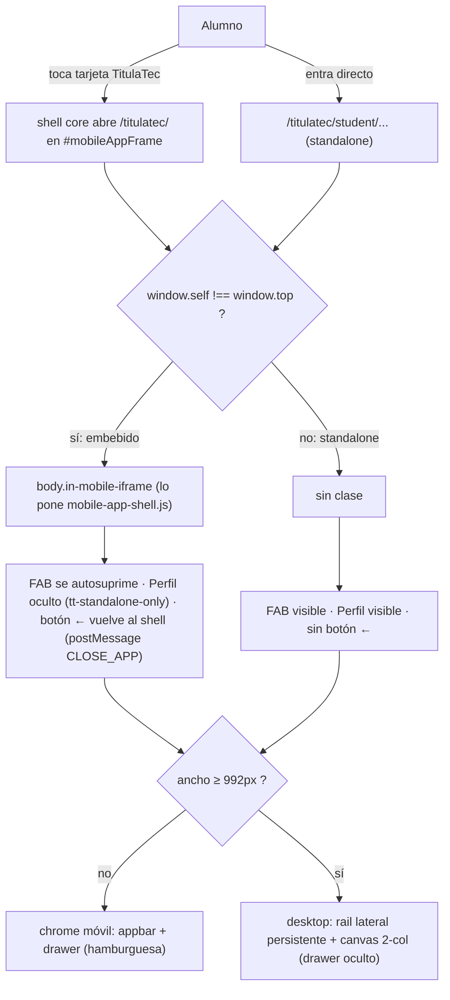

# El alumno usa TitulaTec dentro del shell mobile del core (transversal)

> **Objetivo:** que la vista del alumno se sienta una sola SPA dentro del shell mobile del
> core (`#mobileAppFrame`), sin chrome duplicada, y que siga usable **standalone** (acceso
> directo, también en desktop). Es la **convención de chrome** para toda vista nueva del alumno.

| | |
|---|---|
| **Actor(es)** | 👤 Alumno (`student`) |
| **Permiso(s)** | los de cada vista (dashboard/documents/cita/fase/perfil) |
| **Trigger** | Tocar la tarjeta **TitulaTec** en `/itcj/m/` (embebido) **o** entrar directo a `/titulatec/student/...` (standalone) |
| **Precondiciones** | Sesión iniciada; rol `student` en titulatec |
| **Estado final** | — (chrome; cada vista muta lo suyo) |

## Cómo se integra

El alumno **reutiliza el shell core** (`core/css|js/apps/mobile-app-shell.*`): appbar + drawer
hamburguesa `.app-sidebar` (tematizado con `--app-primary*` = ink/ámbar) y el botón
`.mobile-back-to-dashboard`. Toda vista nueva **extiende `student/base_student.html`** (no
`base.html` directo) y llena los bloques `student_active` / `student_appbar_*` / `student_body`.

## Detección y modos (matriz)

| | bottomnav | navegación | Perfil (drawer/rail) | FAB notif | botón ← |
|---|---|---|---|---|---|
| **Embebido móvil** | solo el del shell | drawer (☰) | oculto | **suprimido** | raíz: vuelve al shell · sub: chevron→dashboard |
| **Standalone móvil** | ninguno | drawer (☰) | visible | visible | sub: chevron→dashboard |
| **Standalone desktop (≥992px)** | ninguno | **rail** fijo | visible | visible | sub: chevron→dashboard |

- **Detección**: `window.self !== window.top` → `mobile-app-shell.js` añade `body.in-mobile-iframe`.
  No hay flag de servidor ni `?shell=1`; el mismo HTML sirve para ambos modos.
- **Sin doble chrome**: se eliminó el `.tt-bottomnav` propio del alumno; embebido usa el bottomnav
  del shell (Inicio/Avisos/Perfil). El botón ← raíz (`#mobileBackToDashboard`, solo embebido) postea
  `CLOSE_APP` al shell; las sub-páginas ponen un chevron a `/titulatec/student/dashboard`.
- **Perfil**: el item `.tt-standalone-only` se oculta embebido (lo cubre el tab Perfil del shell) y
  se muestra standalone → mini-perfil `/titulatec/student/perfil` (ver abajo).
- **Desktop**: `≥992px` el drawer se oculta y aparece un **rail lateral** persistente con la misma
  `student_nav`; el contenido se centra (`.tt-canvas-inner`) y el dashboard pasa a 2 columnas
  (`.tt-dash-grid`). No es un móvil estirado.

## Notificaciones (regla general de toda app)

- El **FAB** por-app (`core/js/notifications/app-fab-widget.js`) **se autosuprime dentro del iframe**
  (`window.self !== window.top`): en móvil la superficie única es el tab **Avisos** del shell (lista
  todas las apps). Standalone/desktop sí muestran el FAB (scope de la app).
- TitulaTec enruta sus eventos por `NotificationService.create(app_name='titulatec')` con
  `data={'url','process_id','phase_number'}` (helper `services/notify.py`). El `action_url` lo lee el
  shell; se añadió `titulatec` a `getAppInfoFromUrl` (`mobile-app.js`) → el click **abre la app en el
  iframe** (no rompe el shell). Iconos/colores de titulatec en `core/models/notification.py`.

| Evento | Tipo | Disparado en | Link (`url`) |
|---|---|---|---|
| Proceso creado (intake) | `PROCESS_CREATED` | `ImportService.commit_import` | fase 1 |
| Documento rechazado | `DOCUMENT_REJECTED` | `DocumentService.review` | fase 1 |
| Fase aprobada | `PHASE_APPROVED` | `PhaseService.approve_phase` | siguiente fase |
| Proceso completado | `PROCESS_COMPLETED` | `PhaseService.approve_phase` (última) | dashboard |
| Fase rechazada | `PHASE_REJECTED` | `PhaseService.reject_phase` | esa fase |
| Cita agendada | `APPOINTMENT_SCHEDULED` | `AppointmentService.create` | fase 2 |
| Cita reagendada | `APPOINTMENT_RESCHEDULED` | `AppointmentService.reschedule` | fase 2 |

## Mini-perfil (standalone)

`GET /titulatec/student/perfil` → identidad (nombre / nº control / correo) + resumen del proceso
(folio / modalidad / convocatoria / fase actual → link dashboard) + **cerrar sesión**. Solo se enlaza
standalone; embebido lo cubre el shell. El alumno reutiliza rol `student` → **no** hay cambio de
contraseña aquí (el endpoint core es solo staff).

## Archivos

- Chrome: `templates/titulatec/student/base_student.html` · `_macros.html` (`student_nav`) ·
  `static/css/titulatec.css` (sección "SHELL DEL ALUMNO").
- Core (transversal): `app-fab-widget.js` (autosupresión) · `mobile/mobile-app.js`
  (`getAppInfoFromUrl` + read PATCH) · `models/notification.py` (icono/color titulatec).
- Notif: `services/notify.py` + hooks en appointment/phase/document/import services.

## Flujos relacionados

- Vistas que viven en este shell: [dashboard/detalle de fase](xcut_student_phase_detail.md),
  [documentos](phase1_student_upload_initial_docs.md), [cita](phase2_appointment_loop.md),
  [Formato B](phase3_student_formato_b.md).
