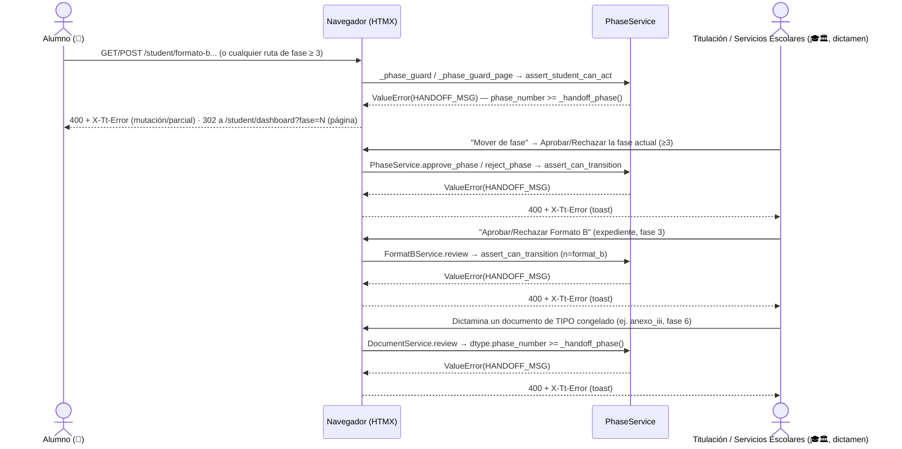
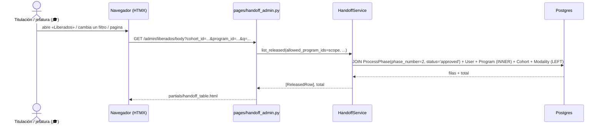

# El proceso pasa a Titulación: corte a T-soft y bandeja de Liberados

> **Objetivo:** que de la fase 3 (Formato B) en adelante el proceso deje de operarse en
> TitulaTec — lo continúa el Departamento de Titulación en su propio sistema (T-soft) — y que
> quién ya soltó Servicios Escolares sea visible desde algún lado.

| | |
|---|---|
| **Actor(es)** | 👤 Alumno (topado en la fase 3) · 🏛️ Servicios Escolares (libera la fase 2, dictamina documentos) · 🎓 Titulaciones/DEP (jefatura de la División, permisos PLENOS desde 2026-09-21: supervisa, dictamina Formato B/documentos/fases y ve Convocatorias, aunque normalmente no sea su trabajo diario) · 🎓 Departamento de Titulación (rol operativo, dictamina Formato B/documentos/fases en el día a día — hoy sin ocupantes) · 🤖 los cuatro puntos de aplicación del corte |
| **Permiso(s)** | El corte en sí **no exige ninguno nuevo** — es ortogonal al permiso, igual que sus gemelas ([`engine_student_phase_lock.md`](engine_student_phase_lock.md)). La bandeja **Liberados** sí: `titulatec.handoff.page.list` (ver/filtrar), `titulatec.handoff.api.export` (CSV) |
| **Trigger** | `TitulationProcess.current_phase` alcanza `PhaseService._handoff_phase()` (config `TITULATEC_HANDOFF_PHASE`, default `3`). Hoy solo ocurre por un camino: Servicios Escolares aprueba la fase 2 (Cita de cotejo) |
| **Precondiciones** | Para aparecer en Liberados: `ProcessPhase(phase_number=2).status == 'approved'` (nada que ver con el estado de la cita) |
| **Sub-flujos** | ⤵ extiende cuatro puntos de aplicación: las dos guardas gemelas de [motor de avance / dictamen del admin](engine_approve_advance_phase.md) y [guarda de ejecución del alumno](engine_student_phase_lock.md), más `FormatBService.review` y `DocumentService.review` (ver abajo). ⤵ la bandeja compone [alcance por carrera](engine_officer_scope.md) |
| **Estado final** | El proceso sigue vivo en BD (`current_phase=3`, fase 3 en `in_progress`); ninguna ruta de esta app puede volver a moverlo. Aparece en Liberados hasta que alguien lo dé de alta en T-soft (fuera de esta app: sin acuse, D12) |

Spec: `docs/superpowers/specs/2026-09-21-titulatec-dpto-titulacion-design.md` (no versionado).

---

## Ruta en la app (UI)

1. **Alumno** → `/titulatec/student/dashboard`. La tarjeta grande de la fase actual pierde su
   CTA y pinta el aviso de T-soft; en el acordeón, cualquier fase futura ≥ 3 pinta el mismo
   aviso en vez de «Se habilitará cuando llegues a esta fase».
2. **Titulación / jefatura de la División** → menú admin → **Liberados**
   (`/titulatec/admin/liberados`) → filtra por convocatoria/carrera/modalidad/búsqueda →
   por fila, «Ver expediente» (`/titulatec/admin/processes/{id}`) o el botón «Exportar CSV»
   arriba de la tabla.
3. **Camino que ya no lleva a ningún lado**: el botón «Mover de fase» del expediente
   (`/titulatec/admin/processes/{id}`) sigue existiendo para *cualquier* fase — al usarlo sobre
   una fase ≥ 3 el POST se rechaza con el mismo aviso.

---

## Secuencia

### a) El corte (intento de actuar sobre una fase ≥ 3)



### b) Bandeja Liberados (solo lectura)



---

## Pasos detallados

### El corte

| # | Actor | UI / dónde | Acción | Endpoint | Service · método | Efecto en BD | Eventos / Notif |
|---|---|---|---|---|---|---|---|
| 1 | 👤 | `/titulatec/student/formato-b`, `/step/{n}` GET/POST y las demás rutas de fase | intenta ejecutar una fase ≥ `_handoff_phase()` | `pages/student.py` (10 rutas guardadas) | `PhaseService.assert_student_can_act` (`services/phase_service.py:214`, vía `_student_action_error`:170-202, chequeo de corte en `:196-198`) | ninguno — corta antes de escribir | ninguno |
| 2 | 👤 | (mutación de fase, vía `FormatBService.submit`) | reenvío de la guarda en el punto de mutación | — | `FormatBService.submit` (`services/format_b_service.py:92-121`) re-invoca `assert_student_can_act` en `:113` | ninguno si falla | ninguno |
| 3 | 🎓/Admin | expediente, botón «Mover de fase» (`_exp_shell.html:28-45`, siempre apunta a `current_phase`; desde 2026-09-21 solo se pinta con `can_dictaminar_fase`, arreglo A2 de la revisión final) | intenta aprobar/rechazar la fase actual (≥3) | `POST /admin/processes/{id}/phase/{n}/approve` · `/reject` (`pages/admin.py:1571-1624`) | `PhaseService.approve_phase` / `reject_phase` → `assert_can_transition` (`services/phase_service.py:121-133`, vía `_transition_error`:72-106, chequeo de corte en `:99-102`) | ninguno | ninguno |
| 4 | 🎓 | expediente, botones «Aprobar/Rechazar Formato B» (`partials/processes/_exp_phase.html:228-244`, solo se pintan con `formato_b.status=='submitted'` **y** `can_dictaminar_fb`, arreglo A2) | intenta dictaminar el Formato B de una fase ≥3 | `POST /admin/processes/{id}/format-b/review` (`pages/admin.py:1540-1568`) | `FormatBService.review` (`services/format_b_service.py:123-157`) reusa la MISMA `assert_can_transition` que la fila 3, con `n = format_b` del catálogo (`:146-147`) — cerrado 2026-09-21, commit `99554755` (Ronda 2 de esta tarea) | ninguno | ninguno |
| 5 | 🏛️/🎓 | bandeja Documentos, botones aprobar/rechazar (`partials/documents_body.html:120-125`, desde 2026-09-21 solo se pintan con `can_review_docs`, arreglo A2) | intenta dictaminar un documento cuyo TIPO pertenece a una fase ≥3 | `POST /admin/documents/{process_id}/document/review` (`pages/documents.py:166-208`) | `DocumentService.review` (`services/document_service.py:194-263`) — chequeo PROPIO y angosto (`:233-237`): rechaza si `dtype.phase_number >= _handoff_phase()` — o, desde el arreglo A4, si el TIPO ya no existe en el catálogo, el respaldo es `doc.phase_number` (falla CERRADO, no abierto) —, **no** mira `current_phase` — cerrado 2026-09-21, commit `c75b352f` (Ronda 2, ver asimetría abajo) | ninguno | ninguno |

### Bandeja Liberados

| # | Actor | UI / dónde | Acción | Endpoint | Service · método | Efecto en BD | Eventos / Notif |
|---|---|---|---|---|---|---|---|
| 1 | 🏛️ | expediente del proceso, fase 2 | aprueba la Cita de cotejo (el acto de liberación) | `POST /admin/processes/{id}/phase/2/approve` | `PhaseService.approve_phase` (`services/phase_service.py:373-439`) | `titulatec_process_phases`: fase 2 → `status='approved'`, `completed_at=now()`; `titulatec_processes.current_phase=3`; fase 3 → `in_progress` | `ProcessEvent(phase_approved)`, notif `PHASE_APPROVED` al alumno |
| 2 | 🎓 | pestaña **Liberados** (`_ADMIN_NAV`, `pages/nav.py:110`) | abre la bandeja / cambia un filtro / pagina | `GET /admin/liberados` (`pages/handoff_admin.py:115-127`) · `GET /admin/liberados/body` (`:130-143`) | `HandoffService.list_released` (`services/handoff_service.py:143-166`) | solo lectura | ninguno |
| 3 | 🎓 | botón «Exportar CSV» — desde 2026-09-21 solo se pinta con `can_export` (arreglo A5); antes de ese arreglo el link seguía ahí y contestaba 403 | descarga el CSV de todo lo que cae en su alcance + filtros | `GET /admin/liberados/export.csv` (`pages/handoff_admin.py:146-192`) | `HandoffService.export_rows` (`services/handoff_service.py:169-183`) | solo lectura | ninguno |

---

## Dictamen de Formato B y de documentos: dos guardas más, con una asimetría a propósito

Hasta el 2026-09-21 (ronda de fix 2/3 de esta misma tarea), **ninguno de los dos dictámenes
pasaba por guarda alguna del corte** — dos huecos reales, no hipotéticos, cada uno cerrado en
su propio commit:

- **`FormatBService.review`** (`services/format_b_service.py:123-157`, vía
  `pages/admin.py::fb_review`, `:1540-1568`) — commit `99554755`. Ganó `process` como
  parámetro nuevo y ahora exige `PhaseService.assert_can_transition(db, process, n)` con
  `n` = fase `format_b` del catálogo (`:146-147`), la MISMA función que usan
  `approve_phase`/`reject_phase` (fila 3 de la tabla de arriba). El hueco era real por el
  propio mecanismo de reversión que esta sección documenta: subir `TITULATEC_HANDOFF_PHASE`
  a 9, dejar pasar un Formato B a `submitted`, y volver a bajarlo a 3 dejaba ese Formato B
  aprobable/rechazable para siempre pese al corte — el corte dejaba de ser cierto justo por
  el camino documentado para desactivarlo.
- **`DocumentService.review`** (`services/document_service.py:194-263`, vía
  `pages/documents.py::review`, `:166-208`) — commit `c75b352f`, encontrado **al cerrar el
  de arriba** (mismo patrón exacto: cero guarda, solo permiso y alcance por carrera). Gana
  un chequeo propio y angosto (`:233-237`): rechaza si `dtype.phase_number >=
  PhaseService._handoff_phase()`, sin mirar `current_phase` en ningún momento. Desde el
  arreglo A4 (revisión final, mismo commit) el respaldo cuando el TIPO ya no existe en el
  catálogo (`dtype is None`) es `doc.phase_number` (columna de la fila, siempre presente) en
  vez de dejar pasar el dictamen sin más — antes `dtype is None` fallaba ABIERTO, justo
  donde el resto del repo falla CERRADO ante la misma ausencia.

**La asimetría entre los dos arreglos es deliberada, no un descuido.**
`assert_can_transition` exige `phase_number == process.current_phase` — correcto para
Formato B, porque ese dictamen SIEMPRE es sobre la fase en curso. Aplicarle la misma regla
a documentos **rompería el dictamen tardío**: revisar HOY un acta de la fase 1 con el
proceso ya en la fase 2 (o más adelante) es el **uso normal** de la bandeja de Documentos
(la cola de rezagados), no una excepción — `DocumentService.save` ya trata la fase del
documento como la del TIPO (`dtype.phase_number`), nunca la del proceso, y esta guarda
respeta la misma idea. Por debajo del corte, el comportamiento de Documentos no cambió ni
un ápice; lo único nuevo es que se cierra el dictamen de un documento cuyo TIPO pertenece a
una fase ya congelada (`anexo_iii` fase 6, `ine`/`residency_proof` fase 7,
`final_project`/`presentation` fase 8 — los tipos de las fases 1 y 2 nunca caen en esta
regla, con o sin corte). Endurecer esta guarda para que también exigiera `current_phase`
sería un **defecto nuevo**, no una mejora: cerraría el dictamen tardío legítimo. Hay un
test que fija ese comportamiento como el deseado, para que nadie lo "corrija" sin darse
cuenta (`test_handoff_phase_cut.py`, el caso donde un documento de fase 1 se sigue
dictaminando tarde con el proceso ya en fase 2 y el corte puesto).

Ninguno de los dos arreglos mueve `ProcessPhase`/`current_phase`: no hay auto-avance en
`FormatBService.review` ni en `DocumentService.review`. Los dos cierran el DICTAMEN fuera
de tiempo; no cambian de qué fase va el proceso. Por eso no contradicen la nota de
["Tiene gemela"](engine_approve_advance_phase.md#guarda-de-transición-desde-2026-09):
`assert_can_transition`/`assert_student_can_act` siguen siendo las únicas dos puertas por
las que `current_phase` cambia — `FormatBService.review` solo REUSA la primera para un
dictamen que no toca `current_phase`.

**`FormatBService.review` no es neutra con el corte desactivado (`TITULATEC_HANDOFF_PHASE=9`)
— y eso es intencional, pero es nuevo.** `assert_can_transition` no exige solo la regla del
corte: exige LAS TRES reglas de `_transition_error` (`services/phase_service.py:72-106`),
y las otras dos no dependen de `_handoff_phase()` en absoluto —
`process.status == 'active'` y `phase_number == process.current_phase`—. Antes de esta
feature `FormatBService.review` no comprobaba ninguna de las dos, con corte o sin él: un
dictamen tardío de Formato B (el proceso ya avanzó a la fase 4) o sobre un proceso
`on_hold` pasaba sin más. Hoy, con el corte en `9`, ambos casos dan **400 +
`X-Tt-Error`** igual — es probablemente lo deseable (revisar un Formato B que ya no
corresponde a la fase actual es un descuido, no un flujo legítimo, a diferencia del
dictamen tardío de documentos), pero es un **cambio de comportamiento sobre el mundo
pre-corte**, no una restauración a como estaba: revertir la variable no revierte esta
parte. `DocumentService.review`, en cambio, **sí es neutra en `9`**: su único chequeo
compara contra `_handoff_phase()`, y con `9` ninguna fase real (0-8) puede ser `>= 9`, así
que la condición nunca dispara — vuelve exactamente al comportamiento de antes de esta
feature.

---

## Estado resultante

- `TitulationProcess.current_phase` queda congelado en `PhaseService._handoff_phase()` (3 por
  defecto): con los cuatro puntos de aplicación puestos, ninguna ruta de esta app puede volver
  a moverlo hacia adelante ni hacia atrás, ni dictaminar Formato B o un documento de una fase
  ya congelada.
- El **único** hecho que consulta la bandeja Liberados es
  `ProcessPhase(phase_number=2).status == 'approved'`, resuelto por número de fase vía
  `PhaseService.phase_number_for_code(db, "review_appointment")`
  (`services/handoff_service.py:86`) — nunca a mano. La fecha que se muestra es su
  `completed_at`, no la fecha de la cita ni la de creación del proceso.
- Leer la bandeja o exportar el CSV **no escribe nada**: `HandoffService` no hace `commit` ni
  `add` (docstring de `services/handoff_service.py:18`).
- Un proceso sale en Liberados **una sola vez**: el criterio es la fila `ProcessPhase`, no la
  cita — los intentos múltiples de cotejo (`no_show`, `superseded`, reagendados) no la duplican,
  y el `UNIQUE(process_id, phase_number)` de `titulatec_process_phases` lo garantiza sin
  necesitar `DISTINCT`.

---

## Cómo revertir el corte

**Antes eran dos pasos, uno de ellos manual; hoy uno solo basta.** El spec original lo
presentaba como una sola variable. La primera revisión de rama (2026-09-21) encontró que eso
era cierto para el PROCESO y falso para QUIÉN podía operarlo, porque en ese momento
`titulatec_titulaciones` (la jefatura de la División) estaba recortada a solo-supervisión
(D6/D7) y el rol que sí dictaminaba (`titulatec_titulacion`) nacía sin ocupantes. **El usuario
revirtió ese recorte el mismo día**: quiere que la jefatura de la División pueda hacer
cualquier cosa en TitulaTec, aunque en el día a día no lo haga. Verificado en BD hoy:
`titulatec_titulaciones` tiene **25** permisos (los 8 de dictamen de fases 3-8, los 2 de
escritura de `ceremony.api.*` y los 3 de `cohort.*` incluidos) y su puesto
(`head_prof_studies_div`) tiene **1 ocupante**. Como ese puesto ya tenía gente asignada desde
antes (es el mismo que usa la bandeja Liberados, ver "Caminos alternos" abajo), apagar la
variable ya basta **por sí sola** para que la jefatura de la División pueda dictaminar de
inmediato — sin ningún paso manual adicional.

**La variable de config apaga las cuatro guardas.** `TITULATEC_HANDOFF_PHASE` en
`itcj2/config.py:292` (default `3`, con piso `Field(ge=3)` desde el arreglo A6 — un valor 0/1/2
tronaría `get_settings()` al arrancar en vez de congelar también la liberación de la fase 2, que
NUNCA debe bloquearse). Fijarla en **`9`** (o cualquier número por encima de la última fase del
catálogo, hoy 8) y **reiniciar el proceso** desactiva los cuatro puntos de aplicación de golpe —
`PhaseService._handoff_phase()` (`services/phase_service.py:65-70`) lee `get_settings()`, que
está cacheado, así que sin reinicio el cambio no aplica.

**El Departamento de Titulación sigue siendo un segundo camino, aparte y todavía vacío.** Que
la jefatura de la División pueda operar sola no significa que el rol operativo (día a día) haya
cambiado: `titulatec_titulacion` se quedó exactamente igual, con sus 22 permisos de siempre.
Verificado en BD hoy: está mapeado a `head_titulacion`/`aux_titulacion`
(`05_insert_position_app_roles.sql`) y **los dos puestos siguen con 0 ocupantes**. Para que el
Departamento de Titulación (y no solo la jefatura) pueda operar, sigue haciendo falta asignar
gente a esos dos puestos desde el organigrama del core (`/itcj/config`) — la vía normal, ya
prevista como paso 3 del runbook de lanzamiento. Mientras eso no pase, todo el dictamen real
recae en quien ocupe `head_prof_studies_div` (o en `admin`, por el 15 dinámico).

Nada de esto toca datos de proceso: un `FormatB` que se quedó en `draft` mientras el corte
estuvo puesto sigue en `draft` después de revertir — nadie lo borra ni lo envía por él. La
bandeja Liberados sigue funcionando igual con cualquier valor de la variable. Y dos escrituras
de fase ≥3 se cuelan por encima del corte MIENTRAS estuvo activo y **no se deshacen** al
revertir — ver "Caminos alternos" abajo.

---

## Desarrollar las fases 3-8 en dev, sin tocar el corte de producción

Mientras el Departamento de Titulación siga operando en T-soft, las fases 3-8 se construyen
**con el corte apagado en dev y puesto en producción**. No hace falta código nuevo: la variable
se lee del `.env` de la raíz, que está gitignored y lo montan todos los servicios del compose de
dev (`docker/compose/docker-compose.dev.yml`, `env_file: ../../.env`). Ese `.env` nunca viaja al
servidor, así que el interruptor es local por definición.

**Receta (verificada de punta a punta el 2026-09-21 contra el proceso real `id=5039`, que está
en `current_phase=3`):**

```bash
# 1. abrir las fases 3-8 en este entorno
echo 'TITULATEC_HANDOFF_PHASE=9' >> .env
docker compose -f docker/compose/docker-compose.dev.yml restart backend   # get_settings() esta cacheado: sin reinicio no aplica

# 2. comprobar que de verdad se abrio (no lo supongas)
docker exec -w /app -e PYTHONPATH=/app itcj-backend-1 python -c "
from itcj2.apps.titulatec.services.phase_service import PhaseService
print(PhaseService._handoff_phase())"     # -> 9

# 3. al terminar, volver al estado que se despliega
#    (quitar la linea del .env y reiniciar) -> _handoff_phase() vuelve a 3
```

Medido con la receta puesta: `can_student_act(fase 3) == True` y `can_transition(fase 3) == True`;
con el corte restaurado, ambas en `False`. Es decir, la variable sola **sí** basta para recuperar
el flujo completo en dev.

**Tres cosas que la variable NO resuelve, y que te van a morder si no las sabes:**

1. **Ya no hace falta ningún paso extra para quien ocupe la jefatura de la División.**
   `titulatec_titulaciones` tiene permisos PLENOS (25, dictamen incluido) desde que el usuario
   revirtió el recorte D6/D7 (§ *Cómo revertir el corte*), y su puesto (`head_prof_studies_div`)
   ya tiene ocupante — para probar el lado admin basta con esa cuenta. Los puestos
   `head_titulacion`/`aux_titulacion` (Departamento de Titulación, rol operativo) siguen sin
   ocupantes: para probar ESE camino específicamente, asígnate uno de los dos desde el
   organigrama del core (`/itcj/config`), o trabaja con el usuario `admin`, que conserva los 84
   permisos por el `15_grant_admin_all_perms.sql`.
2. **`FormatBService.review` quedó más estricta que antes de esta feature, incluso con el corte
   en 9.** Ahora exige `process.status == 'active'` y que la fase 3 sea la actual (hereda
   `assert_can_transition`). Un dictamen tardío que antes pasaba —proceso ya en la fase 4, o en
   `on_hold`— hoy contesta 400. No es el corte actuando: es la guarda nueva, y se queda.
3. **Los tests corren con el corte PUESTO** (default 3). Un test nuevo que ejercite las fases 3-8
   tiene que desactivarlo él mismo, con el patrón que ya usan los otros:
   `monkeypatch.setattr(PhaseService, "_handoff_phase", staticmethod(lambda: 9))` más un
   comentario diciendo por qué. Nunca bajando la guarda.

Cuando llegue el día de abrirlo en producción, el cambio es el mismo (variable + reinicio) **más**
el paso 2 de la sección de reversión: asignar ocupantes a los puestos nuevos.

## Caminos alternos / errores ❗

- **Un proceso sin carrera (`program_id IS NULL`) NUNCA aparece en Liberados, ni con alcance
  `"ALL"`.** El `JOIN` con `Program` en `HandoffService._query` es **INNER a propósito**
  (`services/handoff_service.py:104`, comentado en el código): esa cola de reparación es la
  misma que `scope_service` ya trata aparte, y mezclarla aquí la volvería invisible **para
  todos**, no solo para quien tiene alcance acotado. Hoy hay **0 casos** en BD (verificado), pero
  quien opere la bandeja tiene que saberlo — un liberado así de raro quedaría fuera sin ningún
  aviso en pantalla.
- **Los puestos nuevos nacen sin ocupantes.** `head_titulacion` y `aux_titulacion`
  (`database/DML/titulatec/04b_insert_titulacion_department.sql`) se siembran vacíos — el
  Departamento de Titulación no ve nada hasta que un admin le asigne gente desde el organigrama
  del core (`/itcj/config` → organigrama). Es un paso manual del lanzamiento, no un defecto; la
  jefatura de la División (`titulatec_titulaciones`, vía `head_prof_studies_div`, 1 ocupante
  verificado en BD) sí puede usar la bandeja **y dictaminar** desde el primer momento, porque su
  puesto ya tiene ocupante y desde 2026-09-21 su rol tiene permisos plenos (25).
- **Alcance vacío = bandeja vacía, en silencio.** Igual que el resto de listados con alcance por
  carrera: `scope_service.officer_programs` devolviendo `set()` no es un error, es "no tienes
  carreras asignadas" (`pages/handoff_admin.py:87-89`, `ctx["no_programs"] = True`).
- **`_transition_error`/`_student_action_error` cortan ANTES que la regla de "fase futura"**,
  no después (`services/phase_service.py:99-102`, `:196-198`, con el porqué en el docstring de
  `_student_action_error`): sin ese orden, un alumno parado en la fase 2 que pidiera acción
  sobre la fase 3 leería «se habilitará cuando llegues a ella» — promesa que el corte vuelve
  falsa, porque esa fase ya no se habilita en esta app.
- **Rechazo de fase 2** deja `current_phase = 2`: del lado vivo del corte, nada cambia.
- **El dictamen de Formato B y de documentos también pasa por guarda, desde 2026-09-21** — no
  fue así en la primera versión de esta feature (Tareas 2/3): `FormatBService.review` y
  `DocumentService.review` no comprobaban nada del corte, cada una un hueco real (no
  hipotético) cerrado en su propio commit. Detalle completo, con la asimetría entre las dos
  guardas y por qué es a propósito: ["Dictamen de Formato B y de documentos"](#dictamen-de-formato-b-y-de-documentos-dos-guardas-más-con-una-asimetría-a-propósito),
  arriba.
- **Dos escrituras legítimas cruzan el corte a propósito, y la reversión NO las deshace**
  (hallazgo de la revisión final de rama, no hipotético):
  - **(a) Fases saltadas por modalidad.** Al aprobar la fase 2, `PhaseService.approve_phase`
    marca `skipped` toda fase en `modality.skips_phases` (`services/phase_service.py:406-410`)
    — en dev, la modalidad `egel` salta la 4 y la 5 (verificado en BD:
    `titulatec_modalities.skips_phases = [4, 5]` para `code='egel'`). Esas dos fases están
    `>= _handoff_phase()` y de todos modos se escriben: es correcto, la escritura es un
    efecto secundario de aprobar la fase 2 (que sigue del lado vivo del corte), no un
    dictamen de la fase 4/5 en sí. Pero si se revierte el corte más tarde, esos `skipped` NO
    se deshacen — no hay backfill que los reconsidere.
  - **(b) Alta del proceso.** `ImportService.import_rows` siembra las 9 filas `ProcessPhase`
    (0-8) de un alumno nuevo en un solo `for` (`services/import_service.py:645-648`,
    `status='pending'` para las que no son la 0 ni la actual) — necesariamente escribe filas
    para fases ≥3 desde el primer día del proceso, con o sin corte.
- **Cerrar una convocatoria es una palanca que descuadra los dos sistemas sin avisar —
  riesgo operativo conocido, no un defecto de esta feature.** `CohortService.set_window`
  (`services/cohort_service.py:97-174`, vía `POST /admin/cohorts/{id}/ventana`,
  `pages/admin.py:706-782`, permiso `titulatec.cohort.api.update`) pone en masa
  `status='on_hold'` a **todos** los procesos `active` de la convocatoria que se cierra
  (`:161-171`) — incluidos los que ya pasó T-soft (un proceso en fase 5, por ejemplo). No
  viola el corte: toca `TitulationProcess.status`, no la fase, así que ninguna de las cuatro
  guardas opina. Pero es exactamente el tipo de acción que deja a Titulación operando un
  proceso que TitulaTec acaba de pausar sin que nadie en T-soft se entere — y reabrir la
  convocatoria (`:148-159`) lo **reanuda** igual de en masa, sin mirar en qué fase esté ni
  si Titulación ya hizo algo mientras tanto. Quien administre convocatorias necesita saber
  esto antes de cerrar una con procesos ya liberados hacia T-soft.

---

## Flujos relacionados

- ⇄ Gemelas: [motor de avance de fase (dictamen del admin)](engine_approve_advance_phase.md),
  [guarda de ejecución del alumno](engine_student_phase_lock.md) — el corte es la regla que
  comparten los cuatro puntos de aplicación (las dos de arriba, más `FormatBService.review` y
  `DocumentService.review`, ver "Dictamen de Formato B y de documentos" arriba).
- 📐 Reglas de transición y qué significa "liberado": [máquina de estados](00_state_machine.md).
- ⤵ Alcance por carrera que filtra la bandeja: [engine_officer_scope.md](engine_officer_scope.md).
- 🖥️ Donde el alumno lee el aviso: [acordeón de fases](xcut_student_phase_detail.md).
- 🖥️ Donde Titulación abre el expediente desde una fila de la bandeja:
  [expediente del alumno](xcut_admin_process_expediente.md).
- ← Precede: [Cita de cotejo (loop completo)](phase2_appointment_loop.md) — aprobar su fase 2 es
  el trigger de este flujo.
- → Ya no aplica dentro de la app: [el alumno llena el Formato B](phase3_student_formato_b.md)
  (fase 3, hoy congelada por el corte).
